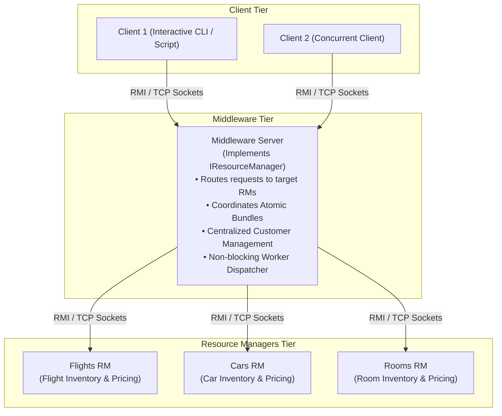

# COMP 512: Distributed Systems (Fall 2026)

## 👥 Authors & Team Information
- **Nathan Hu** — 261147733
- **Rhea Talwar** - 261159882

---

## 📌 Project Overview
This repository contains the coursework and implementation for **COMP 512: Distributed Systems** at McGill University, focusing on **Programming Assignment 1 (PA1): Distributing an Application**.

The application is a distributed, component-based **Travel Reservation System** where clients can query, add, delete, and reserve flights, cars, rooms, and complete bundles across a multi-tier distributed architecture.



### Core Architecture Highlights
1. **Multi-Tier Distribution**: The client connects solely to the **Middleware**, remaining completely decoupled from backend resource partitioning.
2. **Specialized ResourceManagers**: Three independent backend ResourceManagers manage isolated inventories for `Flights`, `Cars`, and `Rooms`.
3. **Customer & Bundle Coordination**:
   - Customer state is managed cleanly at the Middleware layer (Option C), preventing split-brain states across backend services.
   - Atomic bundle reservations execute with two-phase verification and compensating rollbacks upon partial failure.
4. **Dual Networking Paradigms**:
   - **Java RMI**: Dynamic stub export and registration via `rmiregistry`.
   - **TCP Sockets & Non-blocking Concurrency**: Generic message envelope/RPC dispatcher and asynchronous non-blocking request handling at the Middleware.

---

## ⚙️ Prerequisites & Environment
* **Java Development Kit**: JDK 8 or higher
* **GNU Make**: For Makefile builds
* **Python 3.8+**: For automated verification test suites
* **Trottier Lab Machines**: McGill CS `tr-open-*` or `open-gpu*` workstations for distributed 5-node cluster testing.

---

## 🛠 Building the Codebase

### 1. Build Server Components
```bash
make -C pa1/Server
```
This compiles all backend server classes and packages the client interface into `pa1/Server/RMIInterface.jar`.

### 2. Build Client Components
```bash
make -C pa1/Client
```
This compiles the interactive client using the generated `RMIInterface.jar`.

### 3. Clean Build Artifacts
```bash
make -C pa1/Client clean && make -C pa1/Server clean
```

---

## 🚀 Running the System (Local Multi-Terminal)

To run the complete distributed system locally, open separate terminal windows:

### Terminal 1: Start RMI Registry
```bash
cd pa1/Server
./run_rmi.sh
```

### Terminal 2: Start Flights ResourceManager
```bash
cd pa1/Server
./run_server.sh Flights
```

### Terminal 3: Start Cars ResourceManager
```bash
cd pa1/Server
./run_server.sh Cars
```

### Terminal 4: Start Rooms ResourceManager
```bash
cd pa1/Server
./run_server.sh Rooms
```

### Terminal 5: Start Middleware Server
```bash
cd pa1/Server
./run_middleware.sh localhost localhost localhost
```

### Terminal 6: Launch Interactive Client
```bash
cd pa1/Client
./run_client.sh localhost Middleware
```

---

## 🧪 Automated Testing & Verification Suite

Automated verification skills are located in [`.agents/skills/comp512-verifier/`](file:///Users/nathanhu/downloads/COMP%20512/.agents/skills/comp512-verifier):

```bash
# 1. Audit code adherence to COMP 512 lecture slides & rules
python3 .agents/skills/comp512-verifier/scripts/check_course_adherence.py

# 2. Run baseline build & server smoke verification
python3 .agents/skills/comp512-verifier/scripts/verify_pa1.py

# 3. Test specification invariants & domain edge cases
python3 .agents/skills/comp512-verifier/scripts/test_edge_cases.py
```

---

## 📦 Packaging Clean Submissions

To generate a clean zip archive for MyCourses submission (purging all AI memory, course slides, and compiled class binaries):

```bash
python3 .agents/skills/submission-packager/scripts/package_submission.py
```

---

## 📚 Course Reference & Project Memory

For detailed course guidelines, lecture slide summaries (IPC, TCP/UDP Network Stack, RMI, Logical Clocks, Group Communication, FLP Consensus), and synchronization rules, see [`gemini.md`](file:///Users/nathanhu/downloads/COMP%20512/gemini.md).
