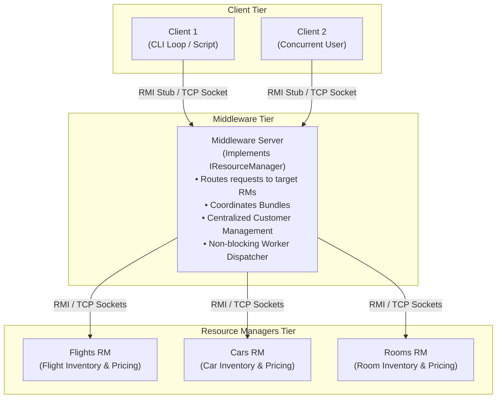
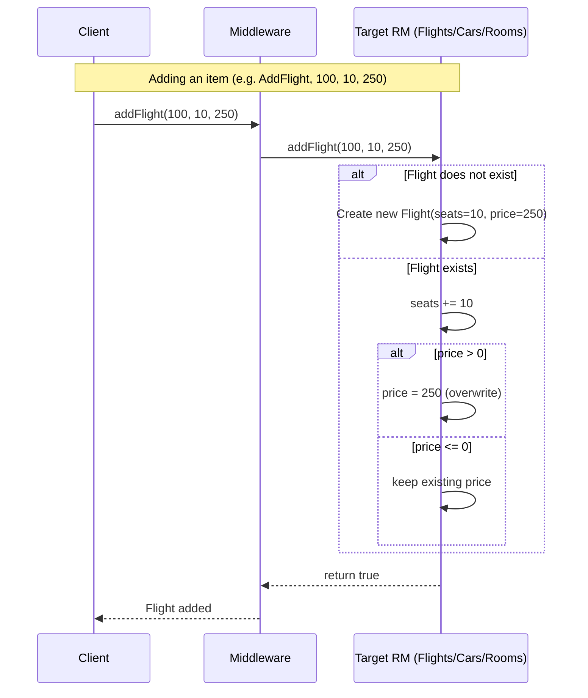
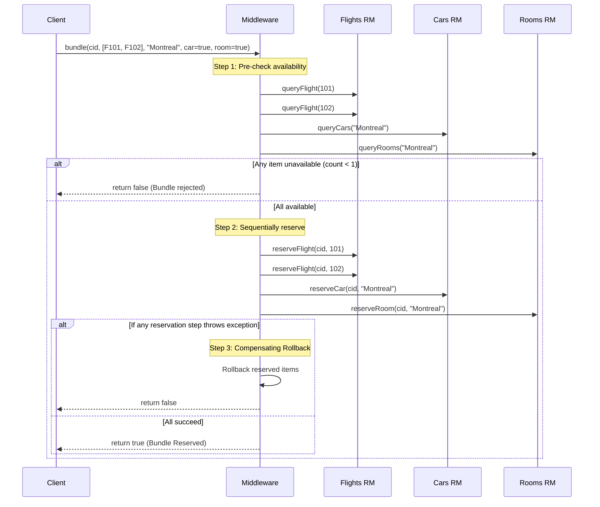
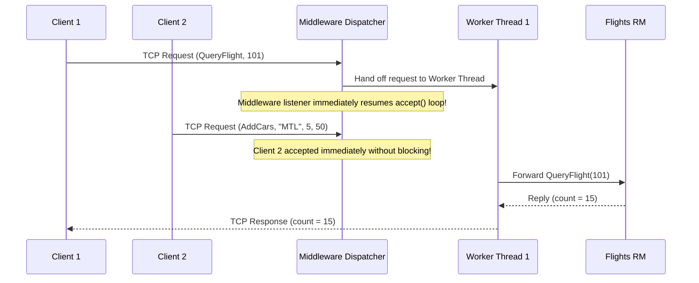

# COMP 512: Distributed Systems Project Context & Guidelines

Welcome to the **COMP 512** workspace. This repository contains the lecture materials, project specifications, starter code, test suites, and implementation for **Programming Assignment 1 (PA1): Distributing an Application** (Travel Reservation System) and subsequent course milestones at McGill University.

---

## 🔄 Self-Updating & Synchronization Protocol

> [!IMPORTANT]
> **Mandatory Agent Rule**: This document (`gemini.md`) is a dynamic, living repository guide. The AI Agent MUST strictly adhere to the following self-updating synchronization protocol:
>
> 1. **Session Initialization & Startup Scan**:
>    * Whenever a session starts or `gemini.md` is read into context, the agent **MUST** scan the repository (checking `git status`, modified/added files in `pa1/`, configuration files, and assignment requirements) to detect any unsynchronized repository changes.
>    * If any drift, new files, modified methods, or completed milestones are detected, the agent **MUST automatically update `gemini.md`** before proceeding with new user tasks.
>
> 2. **Incremental Update Trigger (On Every Code / Feature Change)**:
>    * **After completing any task or making edits** (e.g., implementing Middleware routing, bundle reservations, TCP socket generic envelopes, non-blocking dispatchers, or updating build scripts), the agent **MUST immediately update `gemini.md`**.
>    * Updates must keep the **Implementation Status Matrix**, **Scope Matrix**, **Architecture Details**, and **Workflow Descriptions** fully synchronized with the codebase.
>
> 3. **Continuous Course Content Monitoring**:
>    * The [`Course Content/`](file:///Users/nathanhu/downloads/COMP%20512/Course%20Content) directory contains the authoritative course slides, assignments, and tutorials.
>    * Whenever new documents are added or existing documents are modified in [`Course Content/`](file:///Users/nathanhu/downloads/COMP%20512/Course%20Content), the agent **MUST immediately run the `course-content-monitor` skill**:
>      ```bash
>      python3 .agents/skills/course-content-monitor/scripts/monitor_course_content.py --audit
>      ```
>    * When any changes are detected:
>      1. Parse and extract key requirements, constraints, and protocol rules.
>      2. Update `gemini.md` (Implementation Status Matrix, Scope Matrix, Architecture Details, Protocol Workflows).
>      3. Update verification skills and test scripts in `.agents/skills/comp512-verifier/` (`check_course_adherence.py`, `verify_pa1.py`, `test_edge_cases.py`, `spec_checklist.md`).
>      4. Update `README.md` and codebase implementation if the active milestone is affected.
>      5. Save updated state via `python3 .agents/skills/course-content-monitor/scripts/monitor_course_content.py --save`.

---

## 📚 Course Overview & Academic Context

* **Course**: COMP 512 – Distributed Systems (Fall 2026, McGill University)
* **Instructor**: Prof. Bettina Kemme
* **Project Name**: Distributed Component-Based Travel Reservation Information System
* **Team Members**: Nathan Hu (261147733) & Project Partner
* **Active Milestone**: **Programming Assignment 1 (PA1): Distributing an Application**
  * **Report Due Date**: **October 5, 2026**
  * **Live TA Demonstration**: Week 6 (Following 3 Days after submission)
* **Total Points**: **100 Points**
  * **Part 1.1: RMI Distribution** (25 Points)
  * **Part 1.2: TCP Sockets Distribution & Non-blocking Concurrency** (50 Points)
  * **Part 2: Technical Report & Collaboration** (15 Points: 10 design/architecture/tests/AI token audit + 5 collaboration)
  * **Part 3: Live TA Demonstration & Defense** (10 Points)

### Course Materials Location
* [`Course Content/Slides/`](file:///Users/nathanhu/downloads/COMP%20512/Course%20Content/Slides): Authoritative lecture slides:
  * [`512-2-inter-process-communication.pdf`](file:///Users/nathanhu/downloads/COMP%20512/Course%20Content/Slides/512-2-inter-process-communication.pdf): Basics of IPC, blocking vs non-blocking receive/send, multi-threading, message handlers, network performance (latency vs bandwidth), failure models (omission, crash-stop, crash-recovery, Byzantine), synchronous vs asynchronous distributed systems, reliability.
  * [`512-3-network-stack.pdf`](file:///Users/nathanhu/downloads/COMP%20512/Course%20Content/Slides/512-3-network-stack.pdf): Network stack layers (Application, Transport, Network, Data Link), UDP vs TCP, socket programming (`ServerSocket`, `Socket`, `ObjectInputStream`/`ObjectOutputStream`), TCP sliding window flow control, retransmission timers, sequence numbers, external data representation (serialization, Protocol Buffers).
  * [`512-4-RMI.pdf`](file:///Users/nathanhu/downloads/COMP%20512/Course%20Content/Slides/512-4-RMI.pdf): Request-Reply, Remote Method Invocation (RMI), Remote interfaces (`Remote`), `RemoteException`, stubs/proxies, skeletons/`UnicastRemoteObject`, RMI Registry (`LocateRegistry`, `bind`/`rebind`/`lookup`), remote object references, parameter passing semantics (pass-by-value vs pass-by-reference).
  * [`512-5-time.pdf`](file:///Users/nathanhu/downloads/COMP%20512/Course%20Content/Slides/512-5-time.pdf): Physical clocks, clock drift, Lamport logical clocks, happens-before relation $\rightarrow$, clock condition $a \rightarrow b \implies C(a) < C(b)$, Vector clocks, causal ordering, concurrent events.
  * [`512-6-gc.pdf`](file:///Users/nathanhu/downloads/COMP%20512/Course%20Content/Slides/512-6-gc.pdf): Group Communication Systems (GCS), static vs dynamic groups, multicast primitives, ordering semantics (FIFO, Causal Ordering with vector timestamps, Total Ordering with coordinator, sequencer, or token ring).
  * [`simplisticreliableP2Pprotocol.pdf`](file:///Users/nathanhu/downloads/COMP%20512/Course%20Content/Slides/simplisticreliableP2Pprotocol.pdf): Reliable P2P message delivery protocol (unique ID, sender buffer, delivery queue, ACK, retransmission timer).
  * [`agreement.pdf`](file:///Users/nathanhu/downloads/COMP%20512/Course%20Content/Slides/agreement.pdf): Asynchronous agreement and consensus impossibility results (FLP).
* [`Course Content/Project Docs/`](file:///Users/nathanhu/downloads/COMP%20512/Course%20Content/Project%20Docs):
  * [`COMP512-p1-2026.pdf`](file:///Users/nathanhu/downloads/COMP%20512/Course%20Content/Project%20Docs/COMP512-p1-2026.pdf): Official PA1 specification document detailing RMI distribution, TCP socket requirements, report rubric, and demo guidelines.
  * [`GettingStarted.pdf`](file:///Users/nathanhu/downloads/COMP%20512/Course%20Content/Project%20Docs/GettingStarted.pdf): Starter code setup, RMI registry launch, compilation instructions, and Trottier lab machine guidance.
  * [`clientUserGuide.pdf`](file:///Users/nathanhu/downloads/COMP%20512/Course%20Content/Project%20Docs/clientUserGuide.pdf): Interactive client command syntax, parameter formats, and usage examples.
  * [`AI-logging-examples/`](file:///Users/nathanhu/downloads/COMP%20512/Course%20Content/Project%20Docs/AI-logging-examples): Official sample AI interaction logs (`chatgpt_dump.pdf`, `copilot_dump.json`, `gemini_dump.pdf`).

---

## 🏗 System Architecture & Key Concepts

The system is a component-based distributed information system representing a **Travel Reservation System** where customers reserve flights, cars, and rooms.



### 1. Data Model & Domain Entities
* **Reservable Items**:
  * **Flights**: Keyed by `int flightNum`. Attributes: `int flightSeats` (available count), `int flightPrice`.
  * **Cars**: Keyed by `String location`. Attributes: `int numCars` (available count), `int price`.
  * **Rooms**: Keyed by `String location`. Attributes: `int numRooms` (available count), `int price`.
  * *Single Type Simplification*: Since location is the primary key for cars and rooms, only one car type and one room type exist per unique location.
* **Pricing & Inventory Rules**:
  * Adding an existing item increases available count (`count += addedSeats/count`).
  * If `price > 0`, it overwrites the price for all existing items; if `price <= 0`, the existing price is preserved intact.
* **Customers & Reservations**:
  * Each customer maintains a collection of reserved items (`ReservedItem`) containing the item key, count, and reserved price.
  * `queryCustomerInfo(cid)` returns the itemized bill and total cost across all reservations.
  * `deleteCustomer(cid)` cancels all active reservations, decrementing reserved counts and returning available inventory back to the appropriate ResourceManagers.
  * Deleting a flight, car location, or room location fails if any customer has an active reservation for that item.

### 2. Architecture Tiers & Distribution Model

#### Baseline Monolithic Architecture
In the starter code, a single [`ResourceManager`](file:///Users/nathanhu/downloads/COMP%20512/pa1/Server/Server/Common/ResourceManager.java) manages all three resource types and customer records within a local [`RMHashMap`](file:///Users/nathanhu/downloads/COMP%20512/pa1/Server/Server/Common/RMHashMap.java).

#### 3-Tier Distributed Architecture (PA1 Requirement)
1. **Client Tier**:
   * Runs [`Client`](file:///Users/nathanhu/downloads/COMP%20512/pa1/Client/Client/Client.java) (interactive CLI or automated test script).
   * **Client Interface Invariant**: The client communicates *only* with the Middleware through the standard [`IResourceManager`](file:///Users/nathanhu/downloads/COMP%20512/pa1/Server/Server/Interface/IResourceManager.java) interface. The client is unaware of backend RM distribution.
2. **Middleware Tier (`Middleware`)**:
   * Sits between the client and backend ResourceManagers.
   * Implements [`IResourceManager`](file:///Users/nathanhu/downloads/COMP%20512/pa1/Server/Server/Interface/IResourceManager.java).
   * On startup, takes the addresses/hostnames of backend ResourceManagers (`Flights`, `Cars`, `Rooms`).
   * Routes resource-specific calls:
     * Flight methods (`addFlight`, `deleteFlight`, `queryFlight`, `queryFlightPrice`, `reserveFlight`) $\rightarrow$ `Flights` RM.
     * Car methods (`addCars`, `deleteCars`, `queryCars`, `queryCarsPrice`, `reserveCar`) $\rightarrow$ `Cars` RM.
     * Room methods (`addRooms`, `deleteRooms`, `queryRooms`, `queryRoomsPrice`, `reserveRoom`) $\rightarrow$ `Rooms` RM.
3. **Backend ResourceManagers Tier**:
   * Three separate standalone server processes: `Flights`, `Cars`, `Rooms`.
   * Each runs an instance of `ResourceManager` managing its specific domain items.

### 3. Customer Management Strategy: Design Decision
The specification requires deciding how to handle customer state across the distributed system:
* *Option A (Dedicated Customer RM)*: Introduce a 4th standalone RM server exclusively for customers. Adds deployment overhead (requires a 6th machine/process) and introduces 2-phase coordination between customer RM and inventory RMs.
* *Option B (Replication at all RMs)*: Customer records replicated across all 3 backend RMs. Requires distributed multi-master synchronization whenever customers are created, deleted, or reserve items.
* *Option C (Customer Management at Middleware — Recommended)*:
  * The Middleware maintains customer accounts and reservation mappings directly (Middleware acts as a customer RM).
  * **Rationale**:
    1. Minimizes network hops: Customer queries (`newCustomer`, `queryCustomerInfo`) resolve locally at Middleware without RPC calls.
    2. Single source of truth: Prevents inconsistency or split-brain between backend RMs during reservations.
    3. Simplifies `deleteCustomer`: The Middleware reads the customer's reservation list and dispatches individual release/unreserve calls to `Flights`, `Cars`, and `Rooms` RMs before dropping customer state.
    4. Adheres cleanly to the 5-machine TA demo requirement (Client + Middleware + 3 RMs).

### 4. Bundle Transaction Orchestration
* **Method Signature**: `bundle(int customerId, Vector<String> flightNumbers, String location, boolean car, boolean room)`
* **Challenge**: Reserving multiple items across up to 3 independent backend servers in a single logical transaction.
* **Coordination & Atomicity Strategy**:
  1. **Customer Existence Validation**: Verify `customerId` exists locally.
  2. **Pre-Check / Availability Verification**:
     * Query `queryFlight(flightNum)` for all flights in `flightNumbers`.
     * If `car == true`, query `queryCars(location)`.
     * If `room == true`, query `queryRooms(location)`.
     * If any item has `count < 1`, abort immediately and return `false`.
  3. **Sequential Reservation with Compensating Rollback**:
     * Reserve flights one by one via `reserveFlight(cid, flightNum)`.
     * If any flight reservation fails, rollback already-reserved flights for that customer and return `false`.
     * If `car == true`, reserve car via `reserveCar(cid, location)`. On failure, rollback all reserved flights and return `false`.
     * If `room == true`, reserve room via `reserveRoom(cid, location)`. On failure, rollback reserved car and flights, returning `false`.
  4. **Commit**: If all reservations succeed, return `true`.

---

## ⚡ Concurrency & Network Paradigm Requirements

### Part 1.1: Java RMI Distribution
* **Remote Interface**: [`IResourceManager`](file:///Users/nathanhu/downloads/COMP%20512/pa1/Server/Server/Interface/IResourceManager.java) extending `java.rmi.Remote`. All methods throw `RemoteException`.
* **Exporting & Registration**:
  * Remote objects exported dynamically via `UnicastRemoteObject.exportObject(server, 0)`.
  * Registered in RMI registry using `LocateRegistry.getRegistry(port).rebind(prefix + name, stub)`.
* **Prefix & Port Collision Avoidance**:
  * Default port is `1099`. When multiple students share Trottier lab machines, change port to `30XX` (where `XX` is group number).
  * Remote names prefixed with `group_xx_` (e.g. `group_12_Flights`, `group_12_Middleware`).
* **Shutdown Hooks**: Servers register JVM shutdown hooks (`Runtime.getRuntime().addShutdownHook`) to unbind cleanly from the registry upon exit.

### Part 1.2: TCP Sockets & Asynchronous Concurrency
Re-implement the distributed system replacing RMI with TCP sockets between all tiers:
1. **Client Concurrency Model**:
   * Client remains **blocking** (synchronous request-response): sends request over socket and blocks waiting for reply before allowing the next command.
2. **Middleware Concurrency Model (Mandatory Critical Requirement)**:
   * **The Middleware MUST NOT block** while waiting for backend ResourceManagers to execute a request.
   * When Middleware receives a client request, it forwards the request to the target backend RM and immediately continues accepting and dispatching other client requests.
   * When an RM replies, the Middleware routes the response back to the appropriate waiting client socket.
   * **Implementation Strategy**:
     * Non-blocking I/O using worker thread pools (`ExecutorService`), asynchronous `CompletableFuture`s, or dedicated connection worker threads per active client connection.
     * Middleware maintains a thread-safe correlation table or dedicated per-client worker that handles the lifecycle of the request without tying up the server listener thread.
3. **Backend ResourceManagers Concurrency**:
   * Each backend RM server must handle multiple concurrent requests simultaneously.
   * A thread pool / worker thread dispatches each incoming TCP connection.
   * Internal data structures (`RMHashMap`, item locks) are synchronized to prevent race conditions during concurrent reads/writes (e.g., preventing overselling seats).
4. **Generic Message Wrapping Service (Mandatory Spec Constraint)**:
   * **Spec Rule**: *"If you use AI for this part of the assignment then you MUST present a solution where the wrapping/message creation functionality is a general service/method that can be used for all (or at least nearly) all methods that can be called by the client."*
   * **Design**:
     * A serializable generic message envelope: [`TCPMessage`](file:///Users/nathanhu/downloads/COMP%20512/pa1/Server/Server/Common/TCPMessage.java) containing:
       - `messageId` (UUID / long for request-reply correlation)
       - `methodType` or `methodName` (e.g., `ADD_FLIGHT`, `QUERY_ROOMS`)
       - `arguments` (`Object[]` or `Vector<Object>`)
       - `returnType`
     * A response envelope containing:
       - `messageId`
       - `result` (`Object`: boolean, int, String)
       - `exception` (`Exception` or error message)
     * A generic RPC client proxy implementing `IResourceManager` that marshals any interface call into the generic envelope via Java Dynamic Proxy (`java.lang.reflect.Proxy`) or generic helper:
       ```java
       public Object invokeRemote(String methodName, Object... args) throws IOException, ClassNotFoundException
       ```

---

## 📂 Repository Structure

```
COMP 512/
├── Course Content/                     # Authoritative lecture slides & project documents
│   ├── Slides/                         # Lecture slides covering entire course
│   │   ├── 512-2-inter-process-communication.pdf # IPC, blocking/non-blocking, failures, reliability
│   │   ├── 512-3-network-stack.pdf     # Network layers, TCP/UDP sockets, streams, flow control
│   │   ├── 512-4-RMI.pdf               # RMI architecture, stubs, skeletons, registry, parameter passing
│   │   ├── 512-5-time.pdf              # Physical & logical time, Lamport clocks, Vector clocks
│   │   ├── 512-6-gc.pdf                # Group communication systems, multicast, ordering semantics
│   │   ├── simplisticreliableP2Pprotocol.pdf # Reliable P2P delivery protocol
│   │   └── agreement.pdf               # Asynchronous agreement & consensus impossibility
│   └── Project Docs/                   # Official assignment specifications & user guides
│       ├── COMP512-p1-2026.pdf         # Comprehensive PA1 project specification document
│       ├── GettingStarted.pdf          # Step-by-step setup, compilation, and registry instructions
│       ├── clientUserGuide.pdf         # Complete client command reference manual
│       ├── AI-logging-examples/        # Sample AI chat dumps (PDF/JSON)
│       └── Template.tar.gz             # Clean archive of original starter template
├── pa1/                                # Active PA1 project workspace (Makefile-based)
│   ├── Server/                         # Server codebase (Middleware & ResourceManagers)
│   │   ├── Makefile                    # Server build rules (javac, RMIInterface.jar)
│   │   ├── run_rmi.sh                  # Starts local rmiregistry on configured port
│   │   ├── run_server.sh               # Runs standalone ResourceManager instance
│   │   ├── run_middleware.sh           # Runs Middleware instance connecting to backend RMs
│   │   ├── run_servers.sh              # 5-node tmux/SSH cluster orchestration script
│   │   ├── run_tcp_server.sh           # Runs standalone TCP ResourceManager instance
│   │   ├── run_tcp_middleware.sh       # Runs non-blocking TCP Middleware instance
│   │   ├── run_tcp_servers.sh          # 5-node tmux cluster launcher for TCP architecture
│   │   └── Server/
│   │       ├── Interface/
│   │       │   └── IResourceManager.java # Core Remote interface defining 18 domain methods
│   │       ├── Common/                 # Shared data model & base logic
│   │       │   ├── Flight.java         # Flight entity (flightNum, seats, price)
│   │       │   ├── Car.java            # Car entity (location, numCars, price)
│   │       │   ├── Room.java           # Room entity (location, numRooms, price)
│   │       │   ├── Customer.java       # Customer entity with reservation table & billing
│   │       │   ├── ReservableItem.java # Base reservable item with count/reserved/price
│   │       │   ├── ReservedItem.java   # Customer reservation record
│   │       │   ├── RMItem.java         # Serializable base storage item
│   │       │   ├── RMHashMap.java      # Synchronized hash map storage
│   │       │   ├── ResourceManager.java# Base common implementation of IResourceManager
│   │       │   └── Trace.java          # Diagnostic logging utility
│   │       ├── RMI/
│   │       │   ├── RMIResourceManager.java # RMI server bootstrap & registry binding
│   │       │   └── RMIMiddleware.java  # 3-tier RMI Middleware with Option C customer tracking
│   │       └── TCP/
│   │           ├── TCPMessage.java     # Generic RPC serializable request envelope
│   │           ├── TCPResponse.java    # Generic RPC serializable response envelope
│   │           ├── TCPProxy.java       # InvocationHandler client dynamic reflection proxy
│   │           ├── TCPResourceManager.java # Multi-threaded concurrent TCP backend RM server
│   │           └── TCPMiddleware.java  # Non-blocking multi-threaded TCP Middleware server
│   ├── Client/                         # Client codebase (interactive CLI & automated scripts)
│   │   ├── Makefile                    # Client build rules (depends on RMIInterface.jar)
│   │   ├── run_client.sh               # RMI Client launch script
│   │   ├── run_tcp_client.sh           # TCP Client launch script
│   │   └── Client/
│   │       ├── Client.java             # Abstract client with CLI loop & argument parser
│   │       ├── Command.java            # Command enum & help message definitions
│   │       ├── RMIClient.java          # RMI client implementation connecting to registry
│   │       └── TCPClient.java          # TCP client implementation using dynamic proxy
│   └── README.md                       # PA1 starter readme
├── pa1-students/                       # Legacy student distribution folder (preserved)
├── .agents/
│   └── skills/
│       ├── comp512-verifier/           # Automated PA1 test & verification suite
│       │   ├── SKILL.md                # Skill workflow & instructions
│       │   ├── references/
│       │   │   └── spec_checklist.md   # Complete grading rubric & requirements checklist
│       │   └── scripts/
│       │       ├── check_course_adherence.py # Verifies imports, thread safety, invariants
│       │       ├── verify_pa1.py       # Baseline build & runtime verification harness
│       │       ├── test_edge_cases.py  # Domain logic & specification invariants audit
│       │       └── test_distributed_system.py # End-to-end RMI & TCP integration & concurrency test
│       ├── submission-packager/        # Automated clean submission packager
│       │   ├── SKILL.md                # Skill workflow & instructions
│       │   └── scripts/
│       │       └── package_submission.py # Excludes AI/build junk & runs sandbox compilation audit
│       └── course-content-monitor/     # Continuous course content delta detector
│           ├── SKILL.md                # Skill workflow & instructions
│           ├── manifest.json           # SHA256 state manifest of Course Content
│           └── scripts/
│               └── monitor_course_content.py # Delta scanner & synchronizer
├── .gitignore                          # Excludes class files, jars, OS junk, IDE configs
├── README.md                           # Comprehensive workspace documentation & demo guide
└── gemini.md                           # Dynamic course guidelines & living memory file
```

---

## 🎯 Implementation Status & Scope Matrix

### PA1 Grading & Feature Scope Matrix

> **PA1 Baseline Status**: **Full RMI & TCP Distributed Implementation Complete & Verified**  
> **Course Adherence Score**: **7 / 7 Core Checks Passing, 0 Warnings**  
> (`check_course_adherence.py` [7/7] + `test_edge_cases.py` [5/5] + `test_distributed_system.py` [18/18] + `verify_pa1.py` [3/3])

| Component / Task | Category | Points | Status | Technical Details & Requirements |
| :--- | :--- | :--- | :--- | :--- |
| **Starter Code Syntax Fix** | Plumbing | — | 🟢 Completed | Removed illegal `\x03` control character at [`Client.java:380`](file:///Users/nathanhu/downloads/COMP%20512/pa1/Client/Client/Client.java#L380) enabling clean compile |
| **3-Tier RMI Middleware** | Part 1.1 | 10 pts | 🟢 Completed | [`RMIMiddleware.java`](file:///Users/nathanhu/downloads/COMP%20512/pa1/Server/Server/RMI/RMIMiddleware.java) implementing `IResourceManager`, binding to registry, routing to 3 RMs |
| **3 Dedicated RMs** | Part 1.1 | 5 pts | 🟢 Completed | Standalone `Flights`, `Cars`, `Rooms` RMs running on separate ports/machines with group_21_ prefix |
| **Customer Strategy** | Part 1.1 | 5 pts | 🟢 Completed | Option C: Centralized customer tracking at Middleware (`newCustomer`, cascading `deleteCustomer`, itemized `queryCustomerInfo`) |
| **Bundle Implementation** | Part 1.1 | 5 pts | 🟢 Completed | Multi-resource reservation with availability pre-check and LIFO compensating rollback on partial failure |
| **TCP Generic RPC Service** | Part 1.2 | 15 pts | 🟢 Completed | Generic [`TCPMessage.java`](file:///Users/nathanhu/downloads/COMP%20512/pa1/Server/Server/TCP/TCPMessage.java), [`TCPResponse.java`](file:///Users/nathanhu/downloads/COMP%20512/pa1/Server/Server/TCP/TCPResponse.java), & dynamic [`TCPProxy.java`](file:///Users/nathanhu/downloads/COMP%20512/pa1/Server/Server/TCP/TCPProxy.java) client proxy |
| **Non-blocking Middleware** | Part 1.2 | 20 pts | 🟢 Completed | [`TCPMiddleware.java`](file:///Users/nathanhu/downloads/COMP%20512/pa1/Server/Server/TCP/TCPMiddleware.java): multi-threaded executor thread pool, dedicated sockets per call to eliminate stream corruption |
| **Concurrent RMs (TCP)** | Part 1.2 | 15 pts | 🟢 Completed | [`TCPResourceManager.java`](file:///Users/nathanhu/downloads/COMP%20512/pa1/Server/Server/TCP/TCPResourceManager.java): multi-threaded request dispatch across cached thread pool |
| **Technical Report** | Part 2 | 15 pts | 🟡 Planned | 3–5 pages: RMI & TCP design, message formats, concurrency, customer strategy, test cases, AI token audit |
| **Live TA Demonstration** | Part 3 | 10 pts | 🟡 Planned | 5-machine deployment on Trottier nodes (`tr-open-*`), slide presentation, interactive CLI test cases |

---

## 🔄 PA1 Protocol Workflows & Method Specifications

### 1. Item Lifecycle & Price Preservation Invariant


### 2. Bundle Reservation & Atomicity Protocol


### 3. Asynchronous Non-blocking Middleware Flow (TCP Sockets)


---

## 🧪 Automated Testing & Verification Suite

The repository contains automated test harnesses in `.agents/skills/comp512-verifier/`:
* Concept & Course Adherence Audit: [`.agents/skills/comp512-verifier/scripts/check_course_adherence.py`](file:///Users/nathanhu/downloads/COMP%20512/.agents/skills/comp512-verifier/scripts/check_course_adherence.py)
* Baseline Build & Smoke Test: [`.agents/skills/comp512-verifier/scripts/verify_pa1.py`](file:///Users/nathanhu/downloads/COMP%20512/.agents/skills/comp512-verifier/scripts/verify_pa1.py)
* Domain Logic & Invariant Test: [`.agents/skills/comp512-verifier/scripts/test_edge_cases.py`](file:///Users/nathanhu/downloads/COMP%20512/.agents/skills/comp512-verifier/scripts/test_edge_cases.py)
* Rubric Checklist: [`.agents/skills/comp512-verifier/references/spec_checklist.md`](file:///Users/nathanhu/downloads/COMP%20512/.agents/skills/comp512-verifier/references/spec_checklist.md)

### Running Verification Commands
```bash
# 1. Course content adherence audit (whitelisted imports, syntax, interface integrity)
python3 .agents/skills/comp512-verifier/scripts/check_course_adherence.py

# 2. Baseline build & startup verification
python3 .agents/skills/comp512-verifier/scripts/verify_pa1.py

# 3. Specification invariants & domain logic audit
python3 .agents/skills/comp512-verifier/scripts/test_edge_cases.py
```

---

## 📦 Universal Submission Packaging Protocol

The repository includes an automated packaging skill that generates clean archives for MyCourses without AI memory or build artifacts:
* Skill: [`.agents/skills/submission-packager/SKILL.md`](file:///Users/nathanhu/downloads/COMP%20512/.agents/skills/submission-packager/SKILL.md)
* Script: [`.agents/skills/submission-packager/scripts/package_submission.py`](file:///Users/nathanhu/downloads/COMP%20512/.agents/skills/submission-packager/scripts/package_submission.py)

### Generating & Auditing Submission Zip
```bash
python3 .agents/skills/submission-packager/scripts/package_submission.py
```
*What this automated workflow performs:*
1. Packages only clean source code from `pa1/Server/` and `pa1/Client/` along with `README.md`.
2. Strictly excludes `.agents/`, `gemini.md`, `CLAUDE.md`, AI logs, `Course Content/`, `*.pdf`, `*.class`, `*.jar`, `.git/`, and `.DS_Store`.
3. Extracts the archive into an isolated temporary directory and executes `make` in `Server/` and `Client/` to certify out-of-the-box compilability.

---

## 🔨 Build, Local Execution & Trottier Cluster Deployment

### Prerequisites
* Java Development Kit (JDK 8 or higher)
* GNU Make
* Python 3.8+ (for verification test harnesses)

### 1. Local Build Commands
```bash
# Build Server & RMI Interface JAR
make -C pa1/Server

# Build Client
make -C pa1/Client

# Clean compiled classes & jars
make -C pa1/Client clean && make -C pa1/Server clean
```

### 2. Local Multi-Process Testing
Open separate terminal tabs:

```bash
# Terminal 1: Start RMI Registry
cd pa1/Server
./run_rmi.sh

# Terminal 2: Start Flights RM
cd pa1/Server
./run_server.sh Flights

# Terminal 3: Start Cars RM
cd pa1/Server
./run_server.sh Cars

# Terminal 4: Start Rooms RM
cd pa1/Server
./run_server.sh Rooms

# Terminal 5: Start Middleware (pointing to the 3 RMs)
cd pa1/Server
./run_middleware.sh localhost localhost localhost

# Terminal 6: Launch Client (connecting to Middleware)
cd pa1/Client
./run_client.sh localhost Middleware
```

### 3. McGill CS Trottier Lab 5-Machine Cluster Deployment
For the TA live demonstration, the system must run on **5 distinct machines**:
* **Machine 1**: Client
* **Machine 2**: Middleware
* **Machine 3**: Flights RM
* **Machine 4**: Cars RM
* **Machine 5**: Rooms RM

Recommended hosts: `tr-open-01.cs.mcgill.ca` through `tr-open-05.cs.mcgill.ca` (or `open-gpu-*`).
The [`pa1/Server/run_servers.sh`](file:///Users/nathanhu/downloads/COMP%20512/pa1/Server/run_servers.sh) tmux script orchestrates remote SSH sessions across the 4 server machines automatically.

---

## 🤖 Academic Integrity, AI Logging & Collaboration Guidelines

1. **Course AI Collaboration Policy**:
   * One team member works on the RMI solution **with AI**, while the second works **without AI**.
   * Compare both implementations, select the superior architecture, and document the comparison in the report.
2. **AI Constraint for TCP Sockets**:
   * If AI is used for the TCP implementation, the message wrapping/unwrapping functionality **MUST** be implemented as a **general service/envelope** used across all methods.
3. **Mandatory AI Logging**:
   * Record every AI session used for code generation.
   * Save IDE agent chat sessions as complete JSON exports (including tokens, credit info, and code changes).
   * Save Web/Chatbot interactions as complete printed PDFs (`Ctrl+P`).
   * Keep a running total of estimated tokens used across all sessions for inclusion in the final report.

---

## 🛠 Guidelines for AI Development & Code Modification

1. **Preserve Interface Contract**:
   * Do not alter method signatures in [`IResourceManager.java`](file:///Users/nathanhu/downloads/COMP%20512/pa1/Server/Server/Interface/IResourceManager.java). The client relies on this contract.
2. **Standard Library Restraint**:
   * Use only standard Java libraries (`java.rmi`, `java.net`, `java.io`, `java.util`). Do not import external RPC frameworks (Netty, gRPC, Akka, Spring).
3. **Thread Safety**:
   * Every access to customer collections and item inventory must be guarded against concurrent modifications.
4. **Self-Updating Imperative**:
   * Keep `gemini.md` synchronized whenever new features, classes, or test scripts are created or modified.
